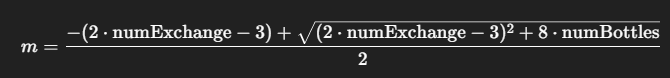

# Problem: Water Bottles II

You are given two integers numBottles and numExchange.

numBottles represents the number of full water bottles that you initially have. In one operation, you can perform one of the following operations:

Drink any number of full water bottles turning them into empty bottles.

Exchange numExchange empty bottles with one full water bottle. Then, increase numExchange by one.

Note that you cannot exchange multiple batches of empty bottles for the same value of numExchange. For example, if numBottles == 3 and numExchange == 1, you cannot exchange 3 empty water bottles for 3 full bottles.

Return the maximum number of water bottles you can drink.

# Solution

The simple way to solve this problem is to follow the steps exactly as the problem states

- Drink numBottles bottle will get numBottles empty bottle
- Each time numExchange empty bottle will get 1 full bottle
- Drink that full bottle and add 1 empty bottle
- Increase numExchange by 1 and repeat

### Somehow, I think a Math way

Combine all changes into a mathematical formula:

- To exchange the ith bottle (in a series of consecutive exchanges), you need numExchange + (i-1) empty bottles
- The total number of empty bottles needed to exchange from numExchange to i is an arithmetic sequence:
  S = numExchange + (numExchange + 1) + ... + i

S = (i + numExchange) \* (i − numExchange + 1) ​// 2

- Solve the inequality: (i + numExchange) \* (i − numExchange + 1) ​// 2 <= emptyBottles
- We find the solution i = (sqrt(1 + 4 _ (2 _ emptyBottles + numExchange \* (numExchange - 1))) - 1) // 2

- Number of full bottles exchanged = i - numExchange + 1
- Number of empty bottles consumed: (i + numExchange) \* (i − numExchange + 1) ​// 2
- Update numExchange = i + 1 for next exchange

### In fact, since numExchange increases very quickly, the number of iterations is not much, so the simple solution is more efficient and more readable than Math solution

## Someone with O(1) solution Math

The number of empty bottles needed for the kth exchange (from the beginning) is:

If you make m successful exchanges, the total number of empty bottles needed is:

You will be able to redeem up to m times if:

Solve the quadratic equation:

Get floor to get maximum number of exchanges m
The result is res = numBottles + m
